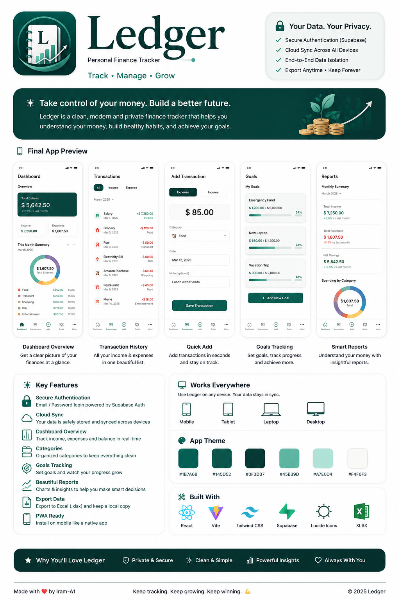

# Ledger

### Track • Manage • Grow

A private, mobile-first personal finance tracker for keeping accounts, spending, savings, credit cards, budgets, and everyday money in one place.

**React · Vite · Supabase · Vercel · PWA**
:::

------------------------------------------------------------------------

## Dashboard Preview

> **Final design concept:** This preview shows the direction of the completed Ledger dashboard. Some visual details may change as the app is polished.



------------------------------------------------------------------------

## What is Ledger?

Ledger is a personal finance web app built to make everyday money tracking simple without turning the dashboard into a spreadsheet.

It brings together:

-   cash and bank accounts
-   savings
-   credit-card balances and available credit
-   expenses and income
-   transfers
-   monthly spending
-   budgets
-   recurring transactions
-   notes
-   reports and backups

The goal is simple: **open Ledger and understand your financial position quickly.**

------------------------------------------------------------------------

## Highlights

### Dashboard at a glance

Ledger brings the most useful numbers together:

-   **Money Available**
-   **Total Savings**
-   **Credit Card Debt**
-   **Available Credit**
-   **Spending This Month**
-   **Net Position**
-   **Recent Transactions**

### Accounts

Maintain separate financial accounts instead of mixing everything into one balance.

Ledger supports everyday accounts, savings accounts, and credit cards.

### Transactions

Supported transaction types include:

-   Expense
-   Income / Add Money
-   Transfer
-   Add to Savings
-   Withdraw from Savings
-   Credit Card Purchase
-   Credit Card Payment
-   Manual Adjustment

Transfers between your own accounts are treated separately from spending, helping keep expense totals meaningful.

### Spending & Categories

Built-in categories cover common expenses such as groceries, restaurants, transportation, housing, utilities, phone/internet, shopping, childcare, health, education, entertainment, subscriptions, travel, bills, gifts, and miscellaneous spending.

Custom categories can also be added.

### Budgets & Recurring Activity

Set category budgets and track repeating activity such as rent, subscriptions, regular income, savings contributions, bills, and credit-card payments.

### Reports & Backups

Ledger supports:

-   Excel export
-   CSV transaction export
-   JSON backup
-   JSON restore

------------------------------------------------------------------------

## Private Accounts & Cloud Data

Ledger uses **Supabase authentication** and user-specific finance storage.

Each signed-in account keeps its own financial data. Separate-user testing has confirmed that different Ledger users can maintain different balances and records.

``` text
Mobile / PWA                Laptop / Browser
     │                             │
     └──────────► Ledger ◄─────────┘
                       │
                       ▼
                 Supabase Auth
                       │
                       ▼
                User Finance Data
```

A user-scoped browser copy can also be used as a fallback while Supabase provides cloud persistence.

------------------------------------------------------------------------

## Security

Ledger is a finance **tracking** application. It is not a password manager or banking vault.

Do **not** store:

-   banking passwords
-   PINs or CVVs
-   full payment-card numbers
-   authentication codes
-   government identification numbers
-   security-question answers

Use account nicknames and balances instead.

------------------------------------------------------------------------

## Installable PWA

Ledger is being configured as a Progressive Web App so it can be installed on a phone and opened more like a standalone application.

Current app-icon assets:

``` text
public/
├── icon-192.png
└── icon-512.png
```

------------------------------------------------------------------------

## Technology

  Area                  Technology
  --------------------- ---------------------
  Front end             React
  Build                 Vite
  Language              JavaScript / JSX
  Authentication        Supabase Auth
  Cloud data            Supabase
  Icons                 Lucide React
  Spreadsheet export    SheetJS / XLSX
  Source control        GitHub
  Deployment            Vercel
  Mobile installation   Progressive Web App

------------------------------------------------------------------------

## Project Structure

``` text
ledger-finance-app/
├── public/
│   ├── icon-192.png
│   └── icon-512.png
├── docs/
│   └── ledger-dashboard-final-preview.png
├── src/
│   ├── App.jsx
│   ├── AuthScreen.jsx
│   ├── ledgerStorage.js
│   ├── supabase.js
│   ├── index.css
│   └── main.jsx
├── README.md
├── index.html
├── package.json
└── vite.config.js
```

------------------------------------------------------------------------

## Run Locally

Install dependencies:

``` bash
npm install
```

Start the development server:

``` bash
npm run dev
```

Create a production build:

``` bash
npm run build
```

Supabase client configuration uses environment variables such as:

``` text
VITE_SUPABASE_URL
VITE_SUPABASE_ANON_KEY
```

Never commit privileged Supabase credentials such as a `service_role` key.

------------------------------------------------------------------------

## Deployment

``` text
Development
     │
     ▼
   GitHub
     │
     ▼
   Vercel
     │
     ▼
Ledger Web App / PWA
```

The repository is connected to Vercel for production deployment.

------------------------------------------------------------------------

## Progress

### Core application

-   [x] Dashboard
-   [x] Account management
-   [x] Transaction tracking
-   [x] Savings tracking
-   [x] Credit-card tracking
-   [x] Spending categories
-   [x] Custom categories
-   [x] Notes
-   [x] Budgets
-   [x] Recurring transactions
-   [x] Excel export
-   [x] CSV export
-   [x] JSON backup and restore
-   [x] Mobile-responsive interface

### Authentication & cloud

-   [x] Supabase client
-   [x] Email/password authentication
-   [x] User-specific cloud data
-   [x] Cross-browser synchronization
-   [x] Logout/login testing
-   [x] Separate-user data testing
-   [x] User-scoped browser fallback

### Deployment & PWA

-   [x] GitHub repository
-   [x] Vite production build
-   [x] Vercel deployment
-   [x] PWA configuration
-   [x] 192 × 192 Ledger icon
-   [x] 512 × 512 Ledger icon
-   [x] Final installed-icon verification
-   [x] Final PWA/offline testing

### Quality pass

-   [x] Full transaction calculation testing
-   [x] Credit-card regression testing
-   [x] Transfer and savings regression testing
-   [x] Edit/delete regression testing
-   [x] Export/restore regression testing
-   [x] Error-handling review
-   [x] Final mobile UX polish
-   [x] Final security review

------------------------------------------------------------------------

## Financial Logic Example

Correct calculations matter more than decorative features in a finance app.

``` text
Starting
Chequing       $2,000
Savings          $700
Card debt        $500
Card limit     $3,000

Spend $100 from chequing
Chequing       $1,900
Spending         $100

Transfer $500 to savings
Chequing       $1,400
Savings        $1,200
Spending         $100

Spend $200 on credit card
Card debt        $700
Available      $2,300
Spending         $300

Pay $300 toward card
Chequing       $1,100
Card debt        $400
Available      $2,600
Spending         $300
```

Moving money between your own accounts should not be counted as new spending.

------------------------------------------------------------------------

## Roadmap

The immediate focus is finishing the product rather than adding random features:

1.  Verify the installed PWA experience.
2.  Complete financial regression testing.
3.  Strengthen error handling.
4.  Polish the mobile interface.
5.  Review security and database access rules.
6.  Improve analytics and budgeting insights after the core is dependable.

------------------------------------------------------------------------

## Disclaimer

Ledger is a personal finance tracking project, not a bank, accounting service, or source of financial advice.

Important balances should always be verified against official financial-institution records.

------------------------------------------------------------------------

:::
### Ledger

**Know what you have. Understand where it goes.**
:::
